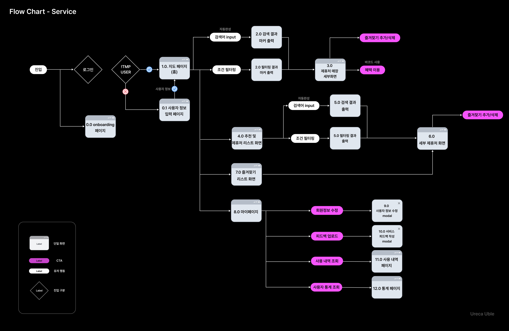
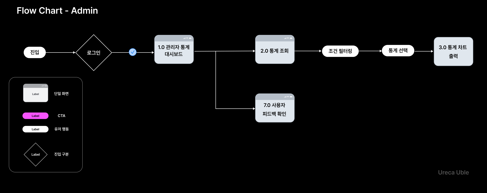

# Uble - 지도 기반 사용자 맞춤 제휴처 추천 서비스

<div align="center">


</div>

<div align="center">

[**UBLE 바로가기**](https://www.u-ble.com)

[**UBLE Admin 바로가기**](https://admin.u-ble.com)

</div>

## 🗺 프로젝트 소개

**UBLE**은 LG유플러스 멤버십 회원의 혜택 이용률과 서비스 만족도를 높이기 위해 개발된 **위치 기반 제휴처 안내 서비스**입니다.  
**네이버 지도 API를 활용**하여 사용자의 현재 위치 또는 지정한 위치를 중심으로 **주변 제휴 매장**을 쉽고 직관적으로 탐색할 수 있도록 지원합니다.

또한, 사용자 정보(성별, 나이, 관심 카테고리 등)와 이용 이력, 시간대 데이터를 분석하여 **맞춤형 제휴처 추천** 기능을 제공함으로써  
사용자가 가장 필요할 때, 가장 적합한 혜택을 누릴 수 있도록 돕습니다.

즐겨찾기로 나만의 제휴처를 저장하고, 마이페이지에서 바코드 등록과 정보 수정도 간편하게 할 수 있어요.

언제, 어디서 어떤 혜택을 얼마나 썼는지도 확인할 수 있어서, 내 멤버십 사용이 한눈에 정리됩니다.

**UBLE은 LGU+ 멤버십 혜택을 찾는 수고를 덜고, 더 똑똑하게 사용하는 경험을 제공합니다.**

## 🚩 프로젝트 개요

| 항목           | 내용                                 |
| -------------- | ------------------------------------ |
| **프로젝트명** | Uble                                 |
| **팀명**       | 맵칠이(MapChillE)                    |
| **주제**       | LG U+ 멤버십 제휴처 안내 지도 서비스 |
| **개발 기간**  | 2025.06.30 - 2025.08.08              |

## 👥 Teams

|                                      송민규                                       |                                      정다희                                      |
| :-------------------------------------------------------------------------------: | :------------------------------------------------------------------------------: |
|  |  |
|                    [@SongMinQQ](https://github.com/SongMinQQ)                     |                    [@alotofhee](https://github.com/alotofhee)                    |
|                                       팀장                                        |                                       팀원                                       |

## ⚔️ 기술 스택

### **Monorepo & 패키지 관리**

|                                                                                                       | 사용 기술 | 역할                               |
| :---------------------------------------------------------------------------------------------------- | :-------- | :--------------------------------- |
|  | Turborepo | 모노레포 관리 및 빌드/캐시 최적화  |
|                 | pnpm      | 패키지 매니저 및 워크스페이스 관리 |

### **프론트엔드**

|                                                                                                                 | 사용 기술     | 역할                                    |
| :-------------------------------------------------------------------------------------------------------------- | :------------ | :-------------------------------------- |
|                        | React         | UI 라이브러리                           |
|                  | Next.js       | React 기반 프레임워크 (App Router 구조) |
|         | TypeScript    | 정적 타입 언어                          |
|      | Tailwind CSS  | 유틸리티 퍼스트 CSS 프레임워크          |
|                     | Lucide        | 아이콘 라이브러리                       |
|       | Framer Motion | UI 애니메이션                           |
|               | Radix UI      | 접근성 높은 UI 컴포넌트                 |
|               | shadcn/ui     | Tailwind 기반 UI 컴포넌트 컬렉션        |
|  | Day Picker    | 날짜 선택 UI                            |
|        | React Barcode | 바코드 생성 및 표시                     |

### **상태 관리 & 데이터**

|                                                                                                            | 사용 기술             | 역할                          |
| :--------------------------------------------------------------------------------------------------------- | :-------------------- | :---------------------------- |
|  | @tanstack/react-query | 서버 상태 관리 및 데이터 패칭 |
|               | Zustand               | 클라이언트 상태 관리          |
|                   | Axios                 | HTTP 클라이언트               |

### **데이터 시각화**

|                                                                                                               | 사용 기술       | 역할                     |
| :------------------------------------------------------------------------------------------------------------ | :-------------- | :----------------------- |
|             | Chart.js        | 데이터 시각화 라이브러리 |
|  | react-chartjs-2 | React용 Chart.js 래퍼    |

### **코드 품질 & 협업**

|                                                                                                                          | 사용 기술            | 역할                       |
| :----------------------------------------------------------------------------------------------------------------------- | :------------------- | :------------------------- |
|                              | ESLint               | 코드 스타일 및 린팅        |
|                        | Prettier             | 코드 포매터                |
|  | Custom ESLint Config | 모노레포 내 공통 린트 설정 |

### **기타**

|                                                                                                                     | 사용 기술         | 역할                       |
| :------------------------------------------------------------------------------------------------------------------ | :---------------- | :------------------------- |
|                    | mkcert            | 로컬 HTTPS 인증서 생성     |
|                | Naver Map API     | 지도 서비스 (유저 앱)      |
|            | Kakao Login       | 소셜 로그인 (유저 앱)      |
|                         | Vercel            | 배포 및 Next.js 앱 호스팅  |
|                          | Sonner            | 알림 및 토스트 메시지      |
|                    | date-fns          | 날짜 유틸리티 라이브러리   |
|                              | vaul              | 모달 및 드로어 UI 컴포넌트 |
|             | use-debounce      | 디바운싱 유틸리티 Hook     |
|  | react-modal-sheet | 하단 시트 UI 컴포넌트      |
|                         | motion            | 경량 애니메이션 라이브러리 |

## 📁 프로젝트 구조

```
uble-fe/
├── apps/                    # 실제 서비스되는 앱들
│   ├── admin/              # 관리자 프론트엔드 앱
│   ├── storybook/          # UI 컴포넌트 개발/테스트용 스토리북
│   └── user/               # 사용자 프론트엔드 앱
│       ├── public/         # 정적 파일 (이미지, 아이콘 등)
│       └── src/
│           ├── app/        # Next.js App Router
│           │   ├── (main)/     # 메인 레이아웃 (홈, 지도, 마이페이지 등)
│           │   └── (no-layout)/ # 별도 레이아웃 (로그인, 회원가입 등)
│           ├── components/ # 공통 컴포넌트
│           ├── hooks/      # 커스텀 React 훅
│           ├── service/    # API 서비스 함수
│           ├── store/      # 전역 상태 관리 (Zustand)
│           ├── types/      # TypeScript 타입 정의
│           └── utils/      # 유틸리티 함수
├── packages/               # 공통 패키지들
│   ├── api/               # API 연동 및 핸들러
│   ├── eslint-config/     # ESLint 공통 설정
│   ├── tailwind-config/   # Tailwind CSS 공통 설정
│   ├── typescript-config/ # TypeScript 공통 설정
│   └── ui/                # 공통 UI 컴포넌트 라이브러리
└── README.md              # 프로젝트 설명 파일
```

## 🧭 Service Flow



## 🤴 Admin Flow



## 📰 Information Architecture


## 💻 Screens

| 기능명                                                     | 설명                                                                                                                                  |
| ---------------------------------------------------------- | ------------------------------------------------------------------------------------------------------------------------------------- |
| **사용자 정보 및 관심사 기반 제휴처 추천** |  <br> 사용자의 나이, 성별, 관심 카테고리 등 프로필 정보를 분석하여 맞춤형 LGU+ 멤버십 제휴처를 추천합니다.|
| **LGU+ 멤버십 제휴처 혜택 정보**                           |  <br> 각 제휴처의 상세한 혜택 정보를 조회하고, 할인 및 이벤트 등의 최신 정보를 제공합니다.                                                  
| **실시간 인기 멤버십 제휴처 정보**                         |  <br> 현재 시간 기준으로 사용자들이 가장 많이 방문한 인기 제휴처 정보를 실시간으로 제공합니다.                                              
| **자동 완성 기능을 탑재한 검색 기능**                      |  <br> 제휴처 및 키워드 검색 시, 사용자 입력에 따라 자동 완성 및 추천 검색어를 실시간으로 제공합니다.                                        
| **지도 기반 제휴처 탐색**                                  |  <br> 사용자의 현재 위치 주변에 존재하는 LGU+ 제휴처를 지도상에서 확인할 수 있으며, 매장 클릭 시 상세 정보가 제공됩니다.                    
| **사용자 지정 위치 저장**                                  |   <br> 사용자가 자주 방문하거나 관심 있는 위치를 지정하여 빠르게 탐색할 수 있도록 저장할 수 있습니다.                                        
| **자동 완성 기능을 탑재한 제휴처 매장 검색 기능**          |  <br> 제휴처 이름이나 키워드를 입력할 때, 관련 매장을 자동 완성 형태로 실시간으로 제안하여 빠르게 탐색할 수 있습니다.                       
| **제휴처 즐겨찾기**                                        |  <br> 관심 있는 제휴처를 즐겨찾기로 저장하여 언제든지 쉽게 다시 확인할 수 있도록 지원합니다.                                                
| **사용자 정보 및 관심 카테고리 등 설정 지원(마이페이지)**  |  <br> 사용자 프로필 정보, 관심 카테고리, 멤버십 등급, 바코드 번호 등 다양한 설정을 마이페이지에서 관리할 수 있도록 지원합니다.             
| **바코드 기반 멤버십 혜택 사용**                           |  <br> 사용자가 등록한 바코드 번호를 기반으로 실제 사용할 수 있는 멤버십 바코드를 자동 생성하여 제휴처에서 혜택을 받을 수 있도록 지원합니다.
| **유저 개인 및 전체 사용자 평균 기준 혜택 사용 통계 조회** |  <br> 개인의 혜택 사용량과 전체 사용자 평균 사용량을 비교하여 시각적으로 제공합니다.                                                       
| **혜택 사용 내역 조회**                                    |  <br> 사용자가 실제 사용한 제휴처 혜택의 사용 내역과 날짜, 사용처, 할인율 등의 상세 정보를 조회할 수 있도록 제공합니다.       

## 📄 산출물  

[기획안](https://docs.google.com/document/d/1Jc75pIE8n0mWEddReLd9L6h3VKGicifBojlAmoiGeNE/edit?tab=t.0)
  
[QA](https://www.notion.so/QA-23a71951642680fea8d9e334f6945acc?pvs=21)
 
[TroubleShooting](https://www.notion.so/troubleshooting-23b719516426804f9a2ce97e0b1e2432?pvs=21)
